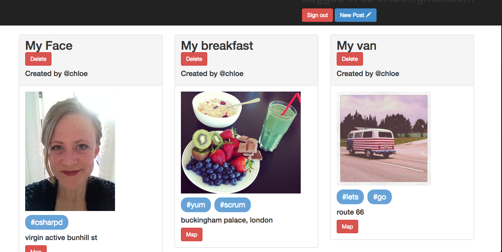

Picagram
=========

A photosharing website



####Deployed
To view, visit: http://picagram.herokuapp.com/

###Objectives

- Get a deeper understanding of Rails and using paperclip to upload pictures onto Amazon S3.
- Learn about many-to-many associations for posts and tags.
- Use the Geolocations capabilities of GMaps to search and display the location of the post.

###Specifications

+ Users can post images and tag them
+ Users can add a location which will then be displayed on a map

###Technologies used

+ Rails
+ Ruby
+ RSPEC
+ Heroku
+ CSS
+ HTML
+ Bootstrap
+ Devise
+ Google Maps API
+ Factory Girl
+ Warden
+ Capybara
+ Amazon Web Services

###Set up

```sh
git clone https://github.com/csharpd/picagramram.git
cd picagram
bundle install
```

###Run

```sh
cd picagram
rails s
```
Open the browser at localhost:3000 to view the app

###Test

```sh
cd picagram
rspec
```

### Possible enhancements
+ General styling & format pictures
+ Pushr (Websockets)
+ Allow users to buy the photos (Stripe)
